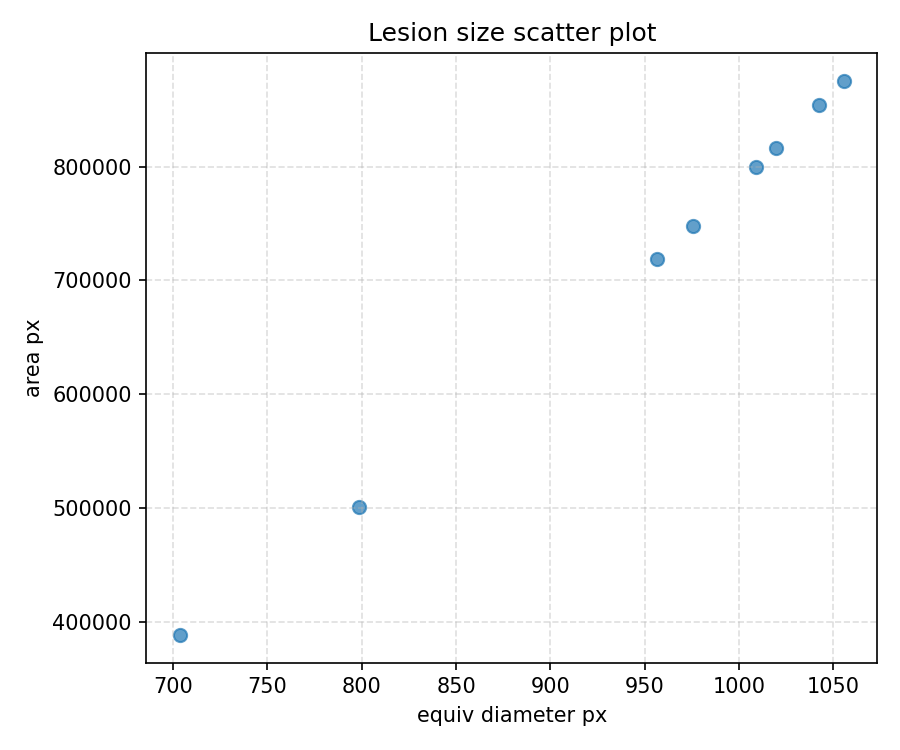
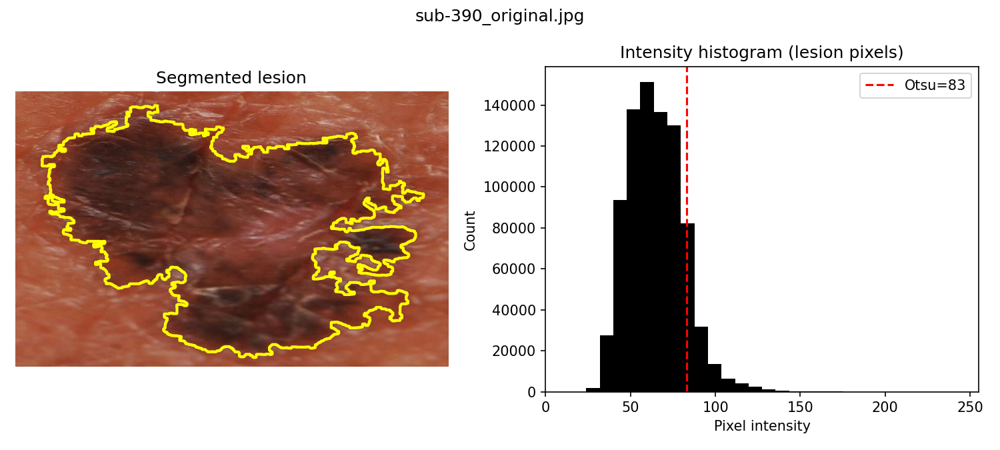

# Lesion Size Analysis — Project Report

Date: 2026-08-12

## Research question

How do lesion sizes distribute in this microscopy/dermoscopy dataset, and what can simple shape features (area, equivalent diameter, circularity, asymmetry) tell us about lesion morphology? Understanding these distributions helps inform downstream modeling choices and quality-control steps for automated lesion analysis.

## Dataset

- Source: downloaded and organized under `data/raw` then preprocessed into `data/processed` by `scripts/preprocess_images.py`.
- Processed images used: 8 images (see `results/features.csv`).
- Features file: `results/features.csv` (per-image shape and color features).
- Summary report: `results/summary_report.txt` contains aggregate statistics used below.

## Methods

- Segmentation: lesions were segmented using Otsu thresholding on grayscale intensity with small Gaussian smoothing and morphological cleanup; the largest connected component was retained as the lesion mask.
- Shape features: area (px), perimeter (px), equivalent diameter (px), circularity (4πA/P²), and a simple ABCD-style asymmetry index.
- Color features: per-channel mean and standard deviation for R, G, B and HSV channels inside the lesion mask.
- Figures: for each image a two-panel figure was saved to `results/figures/` showing the segmented lesion overlaid on the image and a histogram of lesion pixel intensities with the Otsu threshold marked. A summary scatter plot of lesion sizes is saved as `results/lesion_size_scatter.png`.

## Key results

Summary statistics (from `results/summary_report.txt`):

```
Number of images processed: 8

Feature averages (mean ± std) across all images:
  area_px             : 712644.375 ± 175671.103
  perimeter_px        : 7853.664 ± 2574.036
  circularity         :    0.185 ±    0.106
  equiv_diameter_px   :  945.153 ±  126.729
  asymmetry_index     :    0.468 ±    0.200
```

- The mean lesion area is ~713k pixels (std ~176k), with an average equivalent diameter of ~945 px. Circularity is relatively low on average (~0.19), indicating many lesions are non-circular and potentially irregular in shape.
- The most asymmetric and least circular lesion in the sample is `sub-397_original.jpg` (see `results/figures/sub-397_original_features.png`).

## Figures and interpretation

**Figure 1 — Lesion size scatter plot**



Figure 1 shows lesion area (y) versus equivalent diameter (x) for all processed images. The two measures are strongly correlated by construction (area grows roughly with diameter^2), and the scatter confirms a compact cluster of lesions with a few larger outliers. This supports the view that lesion size variation is meaningful and should be considered when designing scale-sensitive features or data augmentation.

**Figure 2 — Representative per-image feature figure**



Figure 2 is an example two-panel figure produced for each image (see `results/figures/`). The left panel overlays the detected lesion contour on the original image; the right panel shows the grayscale intensity histogram of pixels inside the lesion with the Otsu threshold marked in red. In this example the threshold cleanly separates lesion pixels from background, producing a contiguous mask used to compute shape features. If the histogram or overlaid contour looked noisy or fragmented, that would indicate segmentation failure and a candidate for manual QC or improved preprocessing.

## Discussion

- The small sample (8 images) limits broad generalization, but the analysis pipeline successfully extracts interpretable shape and color features and produces per-image visualizations for QC.
- Low mean circularity and elevated asymmetry in some images suggest significant morphological irregularity, which may be clinically relevant (e.g., ABCD asymmetry) or could reflect imaging artifacts.
- The scatter plot confirms size heterogeneity; downstream models should either normalize for scale (e.g., use scale-invariant descriptors) or include size as an explicit predictor.

## Reproducibility — how to run the pipeline

1. Create the conda environment (recommended):

```bash
conda env create -f environment.yml
conda activate venv-tp3
```

2. Download data (if not already present):

```bash
python scripts/download_dataverse.py --doi <DATASET_DOI> --output-dir data/raw
```

3. Preprocess images:

```bash
python scripts/preprocess_images.py --input data/raw --output data/processed
```

4. Extract features and make per-image figures:

```bash
python scripts/extract_features.py --input data/processed --output results
```

5. Create the lesion size scatter plot (already saved to `results/lesion_size_scatter.png` by the helper script):

```bash
python scripts/plot_lesion_sizes.py --csv results/features.csv --output results/lesion_size_scatter.png
```

## Files created

- `results/features.csv` — per-image numeric features
- `results/figures/*.png` — per-image QC figures (segmentation + histogram)
- `results/lesion_size_scatter.png` — scatter plot of lesion sizes
- `results/summary_report.txt` — plain-text summary statistics
- `results/analysis_report.md` — this report

## Next steps

- Increase sample size before drawing stronger conclusions.
- Add scale calibration (if physical dimensions are available) to report sizes in mm rather than pixels.
- Improve segmentation robustness (multi-thresholding, color-space heuristics, or supervised segmentation) and re-run feature extraction.

---

Report generated from pipeline outputs saved under the `results/` folder.
